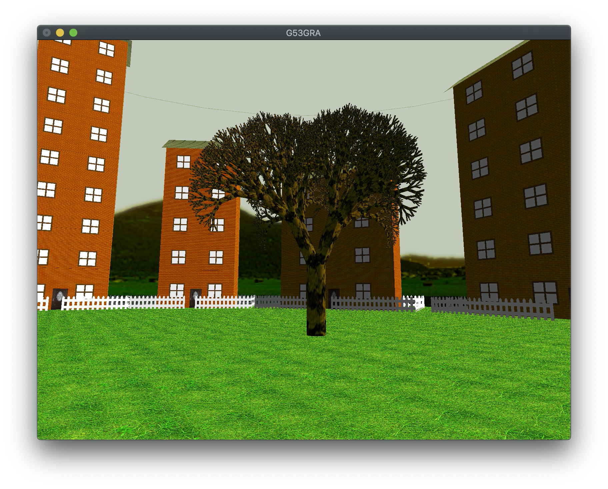
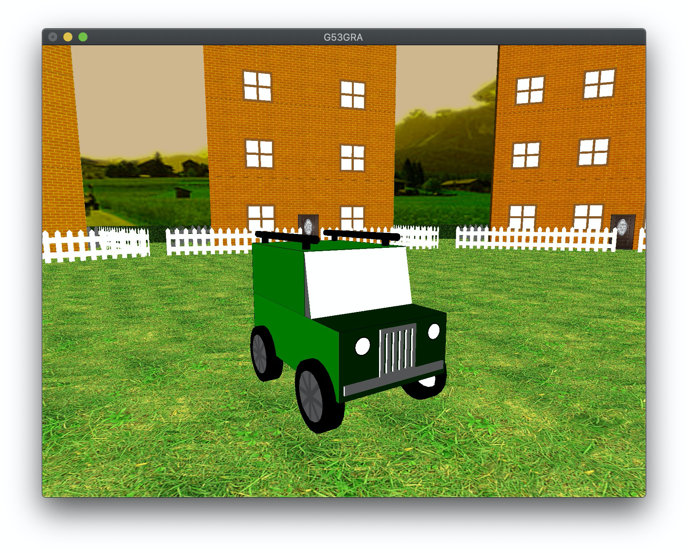
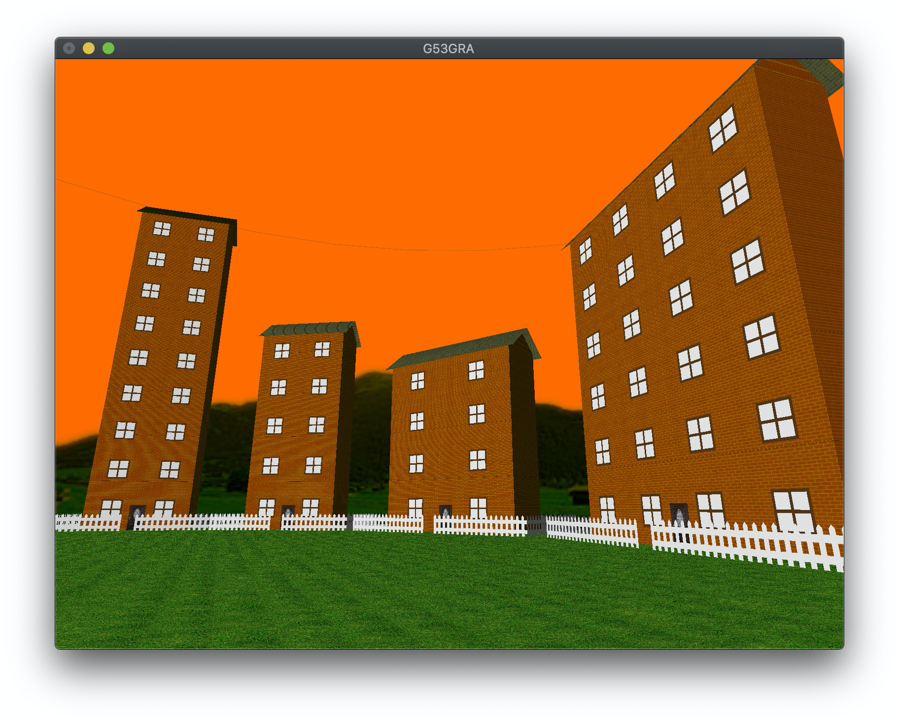
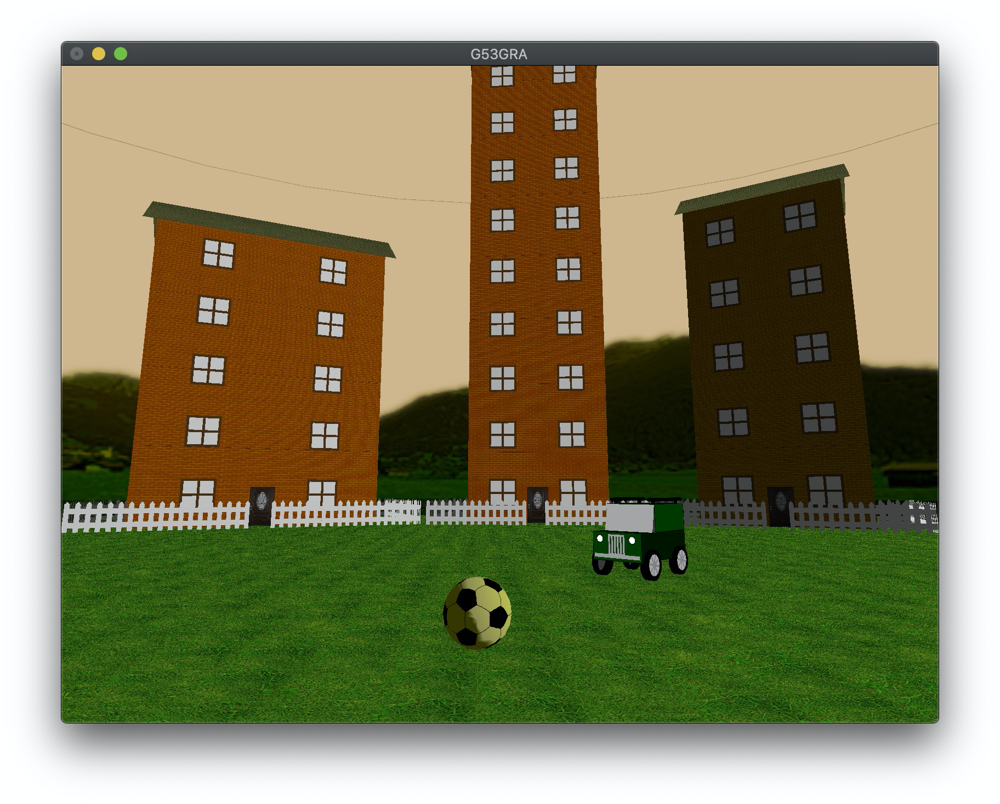
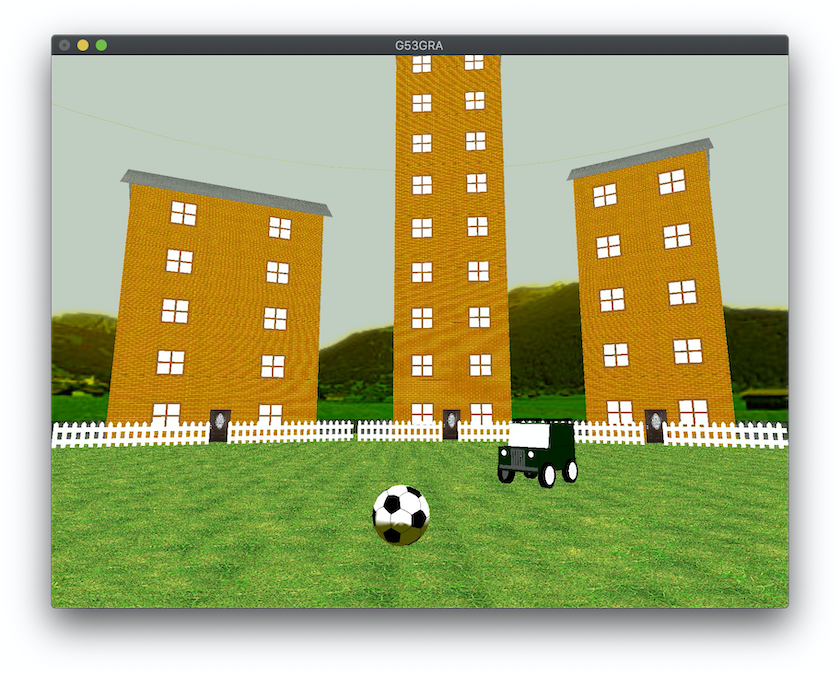
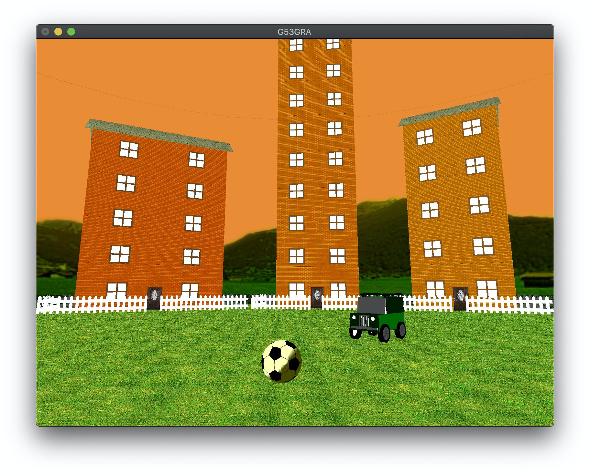
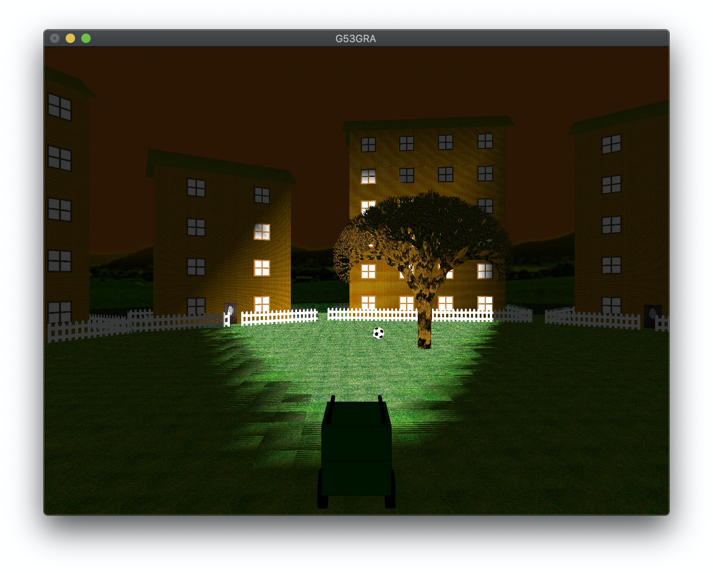
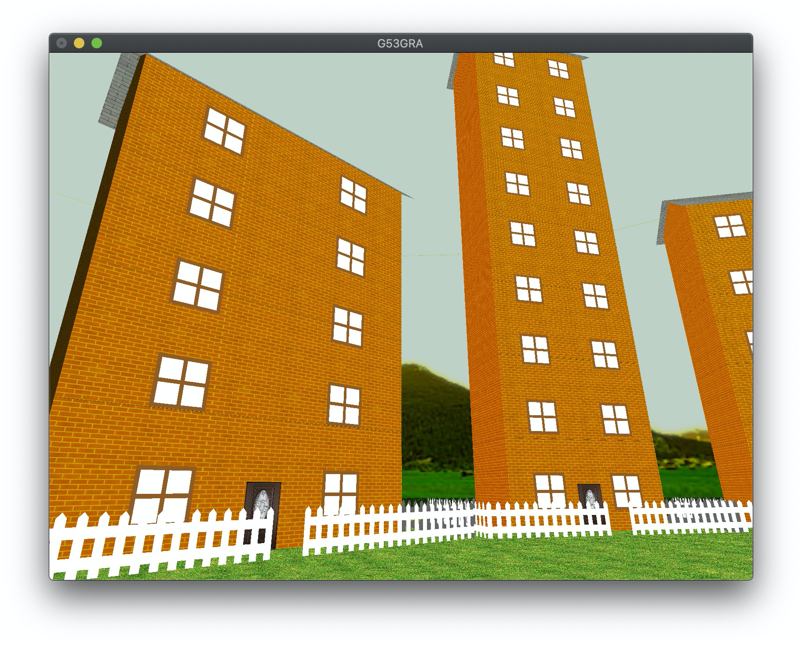
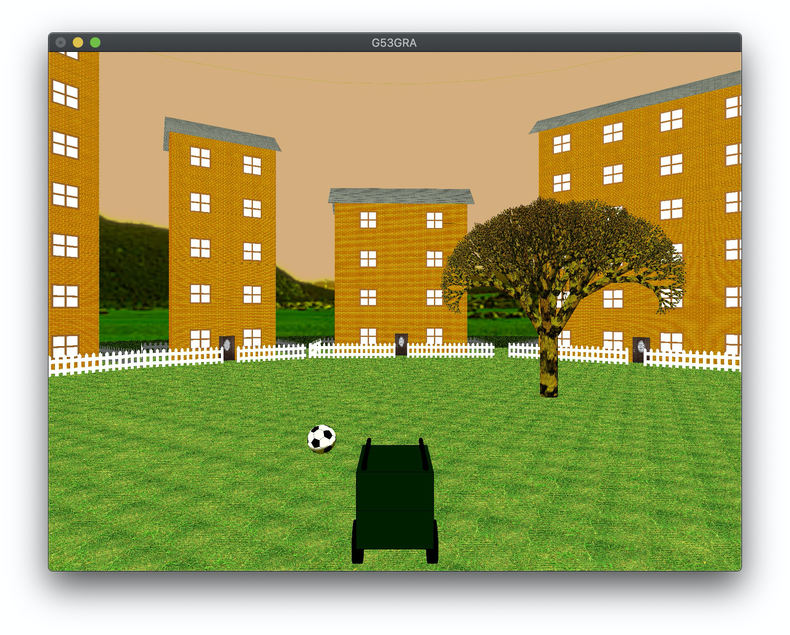

# Vehicular Street Football

Author: Luke Stanislawski

Email: lukestanislawski@gmail.com

---

My inspiration for this project was the game Rocket League. I enjoyed the idea of using a car to interact with a ball in order to move it around the scene. I also decided that I would like to have ago at my own generation algorithm for a certain part of the scene as I have been intrigued by the Minecraft terrain generation algorithm for a number of years. The scene I settled on included a car that could interact with a football, with both surrounded by a dynamically generated circular row of houses. Additionally I added a tree object and a perimeter hedge on order to ensure a solid world boundary that also assists in the seamless implementation of the background.

The camera can be controlled using the WASD keys when in free cam mode and the direction of the camera can be changed by clicking and dragging on the screen. The car is controlled using the arrow keys and the headlights can be turned on/off with the 'l' key. The 'v' key toggles between free-cam mode and third person mode following the car.

## Modelling

### Tree

The tree object consists of numerous cylinder shapes that have been textured with a bark image. The cylinder objects were imported from Shapes.cpp. This file contains many useful basic shapes that are used across the source code. The cylinder shape was drawn using GL_QUAD_STRIPS to draw a series of squares at rotating angles.



The Tree object is drawn recursively, with each branch drawing 4 more up to a certain depth value that is decremented with each subsequent function call. The tree is drawn up to a depth of branches and resembles a tree with no leaves. With certain values of branch depths, certain branches are pruned such that not all 4 branches are drawn. This is because, with a tree depth of 8 and 4 branches being drawn with each iteration, the number of branches in total is 16,384. Each branch is then set to draw 10 quads in order to make the branch. Therefore, 163,840 shapes are needed to be drawn with each frame. This significantly slows down the program. The pruning mechanism is to refrain from drawing the 3rd branch in recursions between the depths of 3 and 5 inclusively.

```c++
void Tree::branches(int depth) {
    branch(10, 80);
    
    if (depth > 1) {
        for (int i=0; i<n_branches; i++) {
            if (i != 3 or depth < 3 or depth > 5) {     // trim some branches
                float theta = (360 / n_branches) * i;
                
                glPushMatrix();
                glRotatef(theta, 0, 0, 1);
                glTranslatef(5,0,75);
                glRotatef(30, 0, 1, 0);
                glScalef(0.7, 0.5, 0.7);
                branches(depth - 1);
                glPopMatrix();
            }
        }
    }
}
```

### Car

The inspiration for the car was a Land Rover Defender. The car is comprised of a series of different shapes that are found in the shapes.cpp file. The majority of these shapes were written to produce a certain size and orientation of shape that can be transformed when being called, rather than allowing for dimensions and orientation values to be passed into the function itself. This initial approach was soon observed to be impractical for certain aspects of the project as it did not allow for the configuring of textures and normals particularly well. For this reason, this approach was used less as the project developed.



### House

The house was designed such that a series of parameters could be passed into the object when being called specifying the dimensions of different aspects of the object such as wall dimensions, fence dimensions, number of windows and roof height. This was so that multiple houses could be generated using a generation algorithm and added to the scene. There is enough variation permitted with each object so as to be noticeably different, but still such that each building appears to be of the same style.

The generation algorithm randomly generates a certain number of house parameter values within a predefined range. The algorithm rotates through 360 degrees drawing the next house such that it is almost touching the previous one, regardless of it's width.



## Lighting

The scene has a day and night cycle that lasts approximately 60 seconds. There is the presence of a sun from which light is emitted. Surfaces from which the sun is visible appear brighter that those from which the sun is not. As well as the presence of the sun object, the colour of the sky changes to simulate sunset and sunrise by blending the pixel values of multiple colours throughout the cycle. The sun orbits the scene through 360 degrees and is always aligned with the player to simulate depth.

<div>
    
    
    
</div>

As well as the spectral and ambient light produced by the sun object, the user is able to toggle the headlight of the car by pressing the 'l' key. The car headlights emit spectral light, the affect of which can be seen reflecting off objects directly ahead of the car and within the light cone.

As the house is dynamically generated, the texture normals had to be calculated at runtime based on the objects orientation and dimensions within the scene. Most notably, the normals of the roof panels had to be calculated based on the height of the roof and the width of the building generated in order to keep consistent lighting.



## Texture

The most notable uses of textures are on the house object. Tile textures are applied to the roof of the house to resemble roof tiling. The door is tiled with a typical door image as this proved to be a more aesthetically pleasing method of drawing a door than using basic shapes and colours, the effectiveness of which is limited by my own artistic abilities. 

Brick textures are also used on the houses to resemble a typical brick used to construct a residential building. The textures on the houses are all dynamically normalised such that the brick appear to be the same size across all buildings, regardless of size and shape. This was necessary as the houses are generated with sizes and shapes that are not known at compile-time. Similarly, the triangular sections of the wall on the sides of the houses are also normalised as the roof height is generated at runtime.

The terrain is textured with a grass texture that reflects the light emitted from the cars headlights as well as the sun. The size of each section of terrain was chosen so as to balance the tradeoff between  the aesthetics of the textures and accurate lighting effects from the reflection of car headlights.

The skybox texture was edited using GIMP image editing software to incorporate an alpha channel. This was necessary as the sky changes colour and therefore would not appear realistic if the sky in the texture did not change colour with it. This required the changing of the framework slightly so as to alter the order of the image's pixel information.



## Animation

### Car

The car object can be controlled using the arrow keys. The user can also toggle between third-person mode following the car and free-cam mode by pressing the v key. The car moves at a constant speed and can turn left or right at a specified angle. The car can only rotate left/right whilst moving forward or backwards, this simulates a more realistic driving experience. Additionally, the rotation direction of the car is flipped when moving forward as opposed to moving backwards in order to more accurately simulate the direction a car would rotate as a result of its wheels being turned. The car's wheels also rotate forward and backwards as the car travels to simulate the car rolling over a surface. Finally, car wheels also rotate left and right with the steering in order to resemble a cars wheels steering.

### Ball

The ball rotates at a speed proportionate to the speed it moves through world space. This simulates the ball rolling along the ground as the axis of rotation is in the direction of motion. The ball decelerates at a constant amount when in motion to simulate the resistance forces acting on the ball.



## Interaction

The car is able to interact with the ball in that it can 'push' the ball in any given direction at a fixed y value. The car is able to push the ball when travelling forwards or backwards. This interaction was achieved by using a series of boundary points located around the exterior of the car. With each rendered frame, a check is carried out to see if any of these boundary points are within a distance from the centre of the ball equal to the radius of the ball. If they are, the ball is given a set speed in the direction of motion of the car. One shortcoming of this approach is that it does not account for the different directions that the ball would naturally move in when being hit off centre.

The car is unable to travel through the tree object. This is achieved by storing the previous location and orientation of the car from the previous frame. If any of the car's boundary coordinates are overlapping with the tree trunk's circumference, the cars position and orientation are reverted.

The car and ball are not able to pass through the fence of any house in the scene. Finding the boundary lines of each house object was a little more challenging as the house fence is a rectangle that can be angled at any orientation around the y axis. Therefore I could not just use a minimum radius from a centre point. The size and shape of each house's fence is also generated at runtime. The boundary was achieved by constructing an inequality equivalent to the equation a line running along each fence. Therefore when certain combinations of these inequalities are evaluated to be true/false, the point can be determined to be inside or outside of the fence boundary surrounding the house. The boundary equations were calculated by using the primitive equation of a line in the form of $y = mx + c$ and applying the corresponding transformations to it.

```c++
bool House::is_overlapping(std::vector<std::vector<float>> coords) {
    float theta = -rotation[1] * M_PI / 180;
    float dx_depth = (fence_depth/2) * sin(-theta);
    float dy_depth = (fence_depth/2) * cos(-theta);
    float dx_width = (fence_width/2) * cos(theta);
    float dy_width = (fence_width/2) * sin(theta);
    
    for (std::vector<float> coord : coords) {
//        Each of the following inequalities is based of the equation of the line of each fence
        bool gt_front = (coord[2] > tan(theta) * ((coord[0] - pos[0]) - dx_depth) + pos[2] + dy_depth);
        bool gt_back = (coord[2] > tan(theta) * ((coord[0] - pos[0]) + dx_depth) + pos[2] - dy_depth);
        bool gt_right = (coord[2] > tan(theta + M_PI/2) * ((coord[0] - pos[0]) - dx_width) + pos[2] + dy_width);
        bool gt_left = (coord[2] > tan(theta + M_PI/2) * ((coord[0] - pos[0]) + dx_width) + pos[2] - dy_width);
        
        if (( (gt_front && !gt_back) || (!gt_front && gt_back) ) && ( (gt_right && !gt_left) || (!gt_right && gt_left) )) {
            return true;
        }
    }
    return false;
}
```

## Conclusion

My scene includes multiple complex objects constructed from many smaller shapes, some of which include complex animated textures that are dynamically created or updated. The scene has a presence of a day and night cycle including the change of directional light within the scene. Multiple different types of lighting are included and adjusted within the scene including emission light emitted from a moving object. The scene also includes multiple animations and interactions between multiple objects, the design of which allows for further objects to be added with ease. The program runs smoothly and provides a realistic experience. 

The most notable parts of this project include the building generation as it was a time consuming process to work out how to calculate a boundary plane dynamically, as well as the interactions between the car and ball which used my own design incorporating the use of boundary points. With additional time, I would like to make the ball able to bounce off vertical objects such as the tree or house fence, reflecting at the correct angle.
